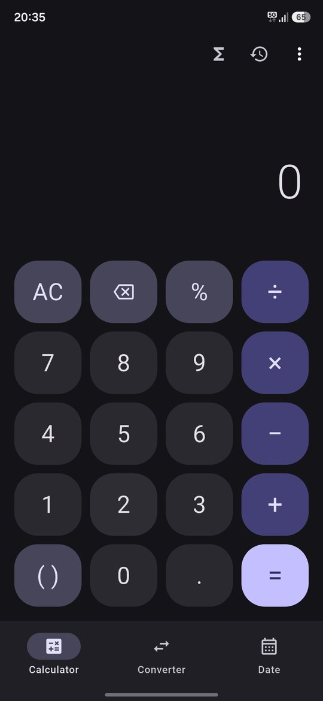
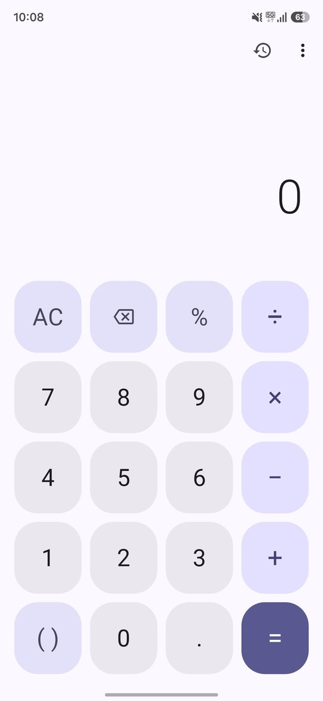
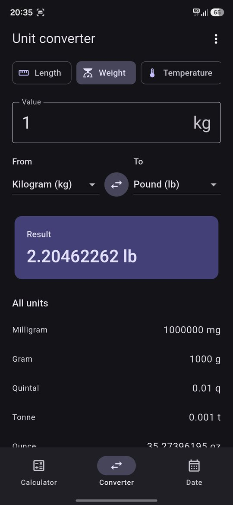
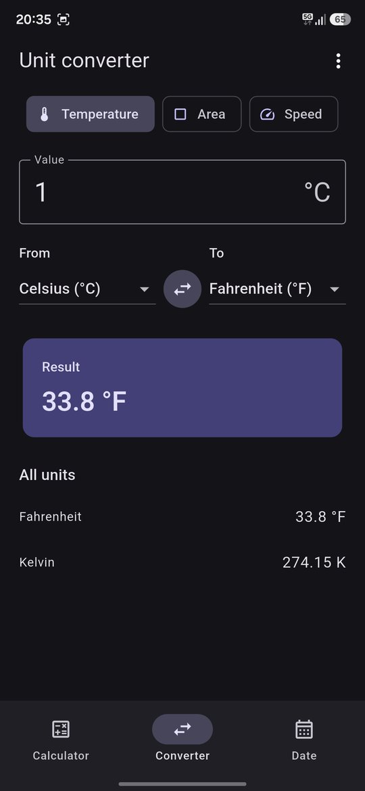
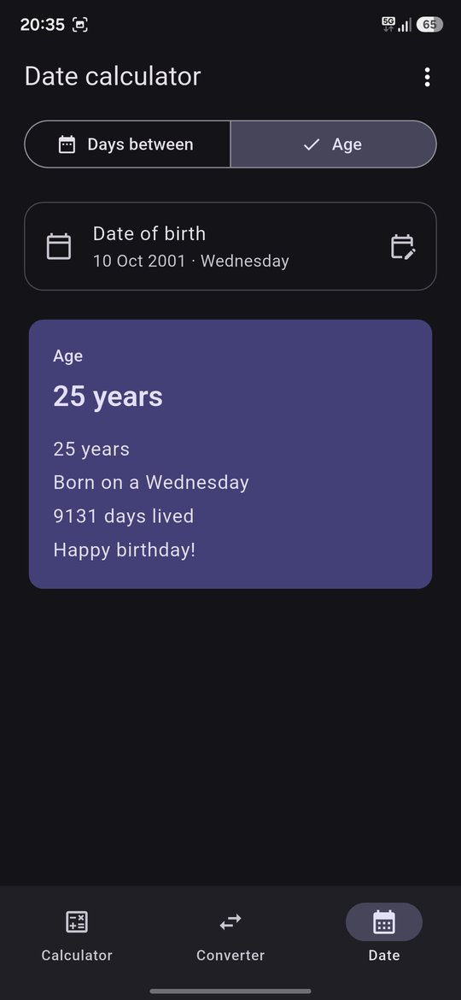
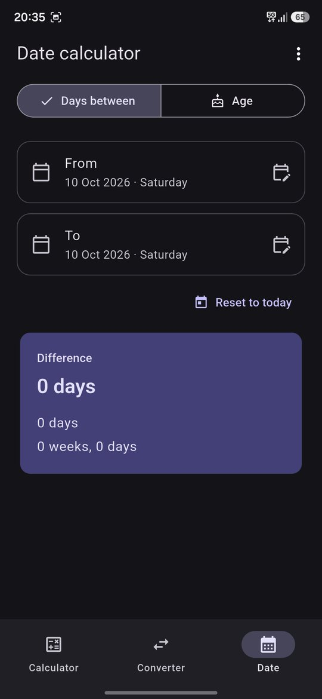

<div align="center">


# Calculator

**A clean, fast and fully offline calculator for Android.**
Scientific mode, unit converter, everyday tools and a date calculator in one small app.
No ads. No tracking. Free and open source.

[](https://github.com/lumio-apps/calculator/releases/latest)
[](LICENSE)


</div>

## Screenshots

<p align="center">
  
  
  
</p>
<p align="center">
  
  
  
</p>

## Features

### Calculator
- Live result preview while you type
- **Scientific mode**: sin, cos, tan, ln, log, √, x², xʸ, 1/x, π and e, with degrees or radians
- Opens automatically when you rotate your phone
- **History** that is saved on your device; tap an entry to reuse it
- Long-press the display to **copy**, **paste** or **share** a result
- Swipe the display to delete the last digit

### Unit converter
11 categories with live results for every unit at once:
Length · Weight · Temperature · Area · Volume · Speed · Time · Data · Fuel economy · Pressure · Energy

### Tools
- **Discount & Tax**: sale price, savings, VAT / GST / sales tax
- **Tip & Split**: tip amount and how much each person pays
- **Percentage**: X% of Y, X as a percent of Y, percent change
- **Loan / EMI**: monthly payment, total interest and total paid
- **BMI**: metric or imperial, with the healthy range for your height

### Date calculator
- Days between two dates, in years, months, weeks and days
- Exact age from a date of birth, the weekday you were born and days until your next birthday

### Make it yours
- Light, dark or system theme with 6 accent colors
- Number formats for every region: `1,234.56` · `1.234,56` · `1 234,56` · `12,34,567.89`
- Choose how many decimal places to show
- Turn key vibration on or off

## Privacy

Calculator works completely offline. It has no ads, no analytics and no accounts, and it never collects or sends your data.
The only network request happens when **you** tap *Check for updates*, which asks GitHub whether a newer version exists.

## Download

1. Open the [latest release](https://github.com/lumio-apps/calculator/releases/latest).
2. Download `Calculator-vX.Y.Z.apk` and open it on your phone.
3. If asked, allow installing apps from your browser or file manager.

Already installed? Open **⋮ → Check for updates** inside the app.

## Build from source

Requires the [Flutter SDK](https://docs.flutter.dev/get-started/install).

```bash
git clone https://github.com/lumio-apps/calculator.git
cd calculator
flutter pub get
flutter build apk --release
```

## Contributing

Bug reports and ideas are welcome in [Issues](https://github.com/lumio-apps/calculator/issues).

## License

[MIT](LICENSE) © Lumio Apps

<div align="center">
<sub>Part of <a href="https://github.com/lumio-apps">Lumio Apps</a>: simple, private, open source apps.</sub>
</div>
